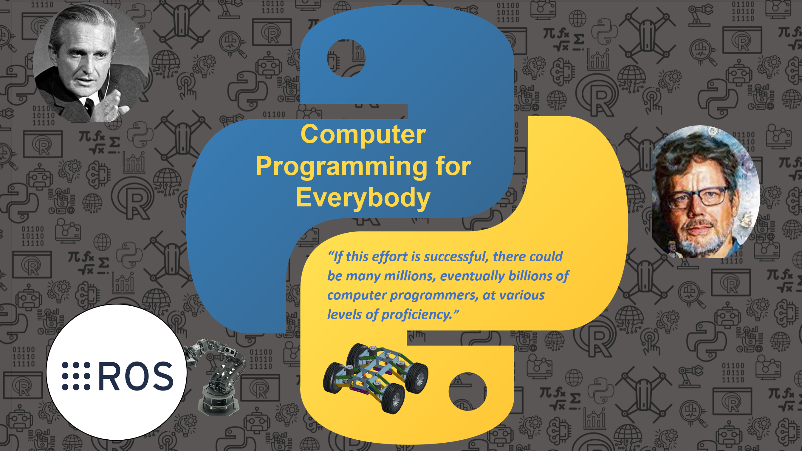

Computer Programming for Everybody. El sueño de que cada persona pudiera programar su propia computadora impulso el desarrollo Python. Construyamos el próximo proyecto de alto impacto.

## Conectando con la comunidad de ROS
- [Proyecto de traducción de documentación de ROS 2](https://github.com/ROS-Spanish-Users-Group/ros2_documentation)
- [Grupo de usuarios de ROS en español discourse](https://discourse.ros.org/c/local/ros-spanish/69)

## The Next Computer Programming for Everybody

<a href="https://www.youtube.com/live/fiEq85l9dTc?feature=share&t=30327" target="_blank"> 
         

## Pycon 2023
- [Day 1](https://www.youtube.com/live/KxbukbKG67c?feature=share)
- [Day 2](https://www.youtube.com/live/fiEq85l9dTc?feature=share)
- [Day 3](https://www.youtube.com/live/KAPHE6akw7Q?feature=share)

## Recursos
- [Computer Programming for Everyone](https://www.python.org/doc/essays/cp4e/), Guido Van Rossum.
- [The mother of all demos ](https://youtu.be/B6rKUf9DWRI). Presentación de Douglas Engelbart demostrando las tecnologias que desarrolladas en su laboratorio (1968).
- [Augmenting Human Intellect: A conceptual framework ](https://www.dougengelbart.org/pubs/papers/scanned/Doug_Engelbart-AugmentingHumanIntellect.pdf), Douglas Engelbart. Como utilizar los computadores como herramientas para empoderar a las personas, volverlas más productivas y apoyarlas a resolver los problemas más importantes que aquejan la humanidad.
- Bootstrapping Douglas Endelbart and the origins of Personal Computing, Thierry Bardin.

### Proyectos personales
- [Robotica movil: Vehiculo autonomo](https://github.com/cychitivav/pai)
- [Brazos robóticos](https://github.com/Robotica-UNAL-G3-A)
